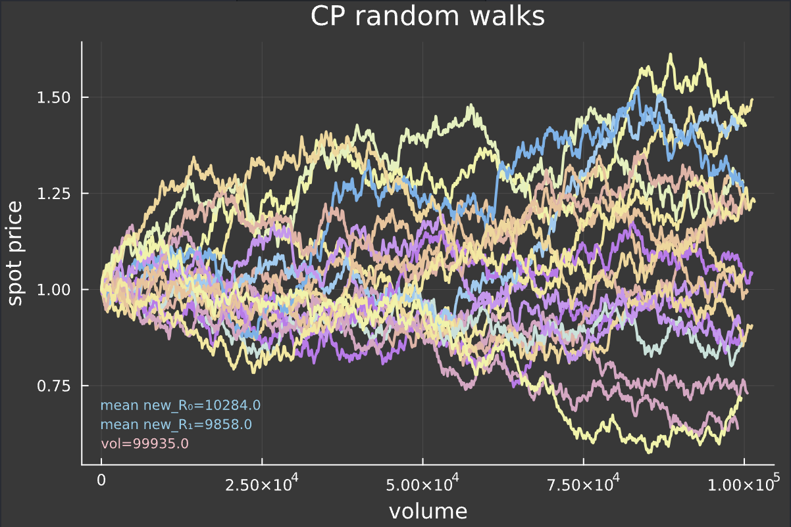
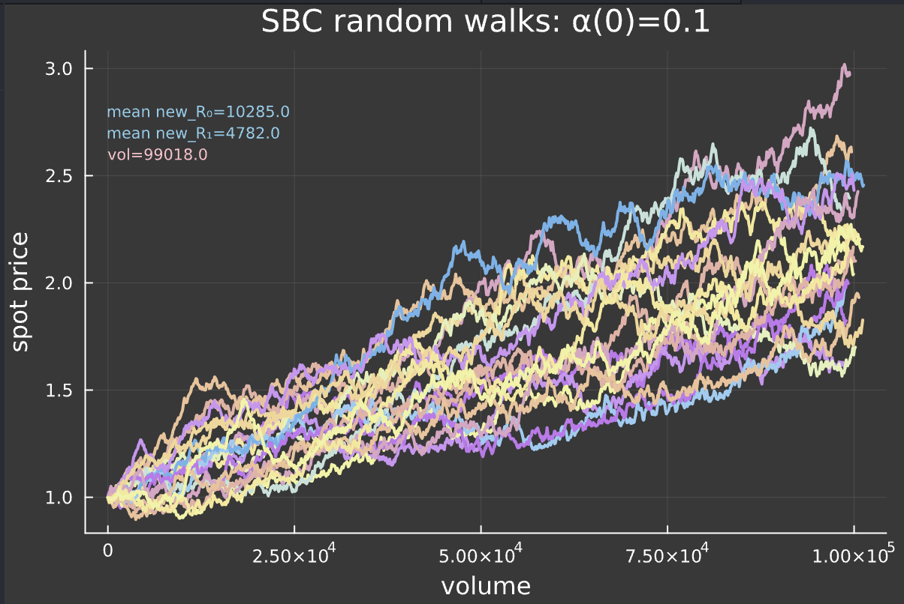
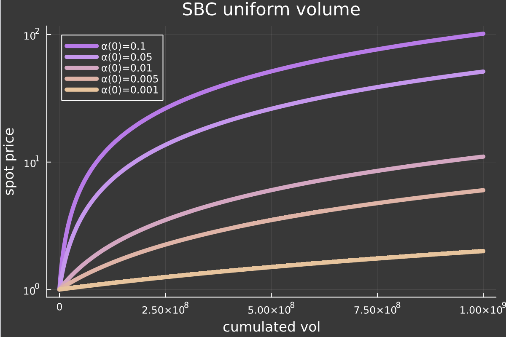
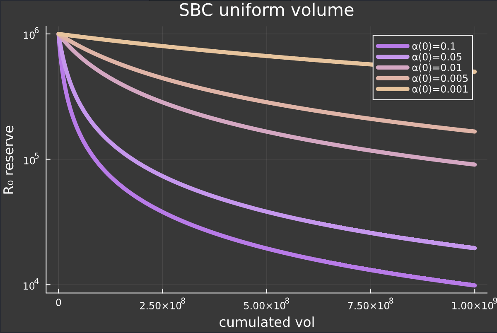

<div align="center">

# [ **Rose** ]

[](https://twitter.com/redrosemoney)

[](https://rose-terminal.vercel.app)

[](http://unlicense.org/)


<!-- [Discord](https://discord.gg/redrose) •  -->
[twitter](https://twitter.com/redrosemoney) • [Website](https://rose-terminal.vercel.app)

</div>

---

- [Introduction - The Bloom](#introduction---the-bloom)
- [Definition - The Garden](#definition---the-garden)
  - [The Asymmetric AMM](#the-asymmetric-amm)
<!-- - [Usage](#usage)
  - [App](#app)
  - [Contracts](#contracts) -->

---

## Introduction - The Bloom

*23/07/2024*

**A New Era**

```md
Here lies a manifesto for freedom,  

A Rose, blossoms in the sky.

🌹
```

## Definition - The Garden

2024 has been a wild year on-chain.  
CORPs raising millions of dollars waiting to dump on your stupid ass to buy a mansion in beverly hills.  
One of the most profitable trades this year has been shorting worthless VC projects to zero.

A nihilistic economic paradigm emerged to challenge the established power structure.

We've witnessed the resurgence of memecoins, tokens with no pretense of intrinsic value derived from being loosely tied to a product, and custom lauch bonding curves designed for fairer coin creation.

This is a reality check for everyone. You cannot stitch a token to a product.

**In crypto, the token is the product.**

In the midst of this, a flower.

Rose is part of the new generation of cypherpunk finance, improving on the core aspects of the current state:

- **Price performance**: Rose cleverly exploits the AMM model to bind price performance to volume.
- **Fair distribution**: fairly distributed on day one, without premine, snipers or external funding.
- **Community owned**: Rose DAO is fully decentralized, leveraging the [RWGM](#rose-dao) algorithm to democratically allocate funds.
- **Uncompromised security**: Rose settles on mainnet, where communities can access true decentralization and privacy. We don't fuck with the feds.

### the Asymmetric AMM

**Rose** implements an asymmetric bonding curve that optimizes for *price upside volatility* and *deep liquidity* on exits, **mimicking an [Asymmetric AMM](https://github.com/RedRoseMoney/rose-research/blob/main/src/ContinuousModel.jl)**.

An Asymmetric AMM ($aAMM$) is a Bonding Curve with two distinct formulas for buy and sell orders.  
[Rose aAMM market implementation](https://github.com/RedRoseMoney/rose-core/blob/main/src/Rose.sol) decreases liquidity on buy orders to increase upside volatility, while providing deep liquidity for sellers. As a result, for an equivalent long/short volume, the price will increase *proportionally to the volume itself*.  
**This is unlike traditional AMM bonding curves where a long/short ratio of 1 implies no price changes***  
*ignoring plateform fees

For every buy order, a skew parameter $α$ determines the quantity of the reserves to withdraw.  
A penalty is added on sell orders to incentivize long-term holding, dictated by the slash-factor $ϕ$.  

<div style="display: flex; flex-direction: row; justify-content: space-between; gap: 10px;">
  
</div>

*Constant-product random walk. initial reserves: (10k, 10k). The random walk is generated from a series of buy and sell orders drawn from a Laplace distribution with parameters (μ=0, θ=10), with a total volume of 100k.
The multiplicative relation is preserved:
We get the same results with reserves of (1m, 1m) and 10m in volume.*

<div style="display: flex; flex-direction: row; justify-content: space-between; gap: 10px;">
  
</div>

*Asymmetric AMM random walk. initial reserves: (10k, 10k) and initial α: 0.1. Laplace parameters (μ=0, θ=10), with a total volume of 100k.*

#### α parameter

In practice, the skew parameter $α$ is dynamically adjusted using the remaining reserves to ensure it reaches an optimal spot in the tradeoff between upside volatility, slippage and total available liquidity.

<div style="display: flex; flex-direction: row; justify-content: space-between; gap: 10px;">
  
</div>

*Spot price of Rose after 1b volume with variation of the α parameter. Log scale, denominated in ETH, starting at 1 with reserves (1e6, 1e6).
Volume is uniform across both buy and sell orders.*  
*reading: for 1b total volume (500m buys and 500m sells), the price mechanically increases by ~1000% for α = 0.01.*

By the constant-product formula, there is a proportional relation between the reserves liquidity and volatility for a fixed amount bought. Rose controls volatility by reducing market depth on buy orders, while preserving deep liquidity on sell orders.

<div style="display: flex; flex-direction: row; justify-content: space-between; gap: 10px;">
  
</div>

*Reserve R₀ amount, uniform volume of 1b with varying α, log scale.
starting from reserves (1e6, 1e6).  
reading: for 1b total volume (500m buys and 500m sells), R₀ decreases by ~90% with α = 0.01.*

#### Burns and buybacks

Since a buy order is not executed on full liquidity, the reserves ratio increases faster than a classical AMM pool, thus leaving an excess of `rose` when reinjecting liquidity.  
This excess amount is removed from the reserves then burned, creating a net deflationary asset, without traditional deflation shortcomings:

*Rose's aAMM binds the asset deflation to market liquidity.*

In theory, when the monetary mass of an asset decreases, price automatically increases because the total monetary value is still the same, but distributed over less supply.  
In practice, a burn doesn't directly affect market liquidity and often does not meaningfully implies price appreciation.

the aAMM ensures mechanical price appreciation from volume by permanently removing liquidity from the market, weighted by the skew parameter $\alpha$.

A 1% penalty on sells is added to load the treasury in the denominating asset, and is used to proceed to strategic buybacks to further support `Rose` price.

Punk Money is a collective of post-scarcity builders, artists and degens. Every product from the Punk Money collective will have a 1% tax on utilisation, from which 50% will collected for automated buybacks and burn.

We don't respect the CORP,

Rose is *new-money*, Rose is *PUNK money*.

<!-- ## Usage

### App

#### Install dependencies

```shell
$ cd app
$ npm install
```

#### start the development server

```shell
$ npm start
```

### Contracts

#### Install

```shell
$ curl -L https://foundry.paradigm.xyz | bash

$ foundryup
```

#### install dependencies

```shell
$ cd contracts
$ forge install .
```

#### Build

```shell
$ forge build --via-ir
```

#### Test

```shell
$ forge test --via-ir
```

#### Gas Snapshots

```shell
$ forge snapshot --via-ir
```

#### Deploy

```shell
$ forge script script/<ScriptName>.s.sol:<ScriptName>
``` -->
